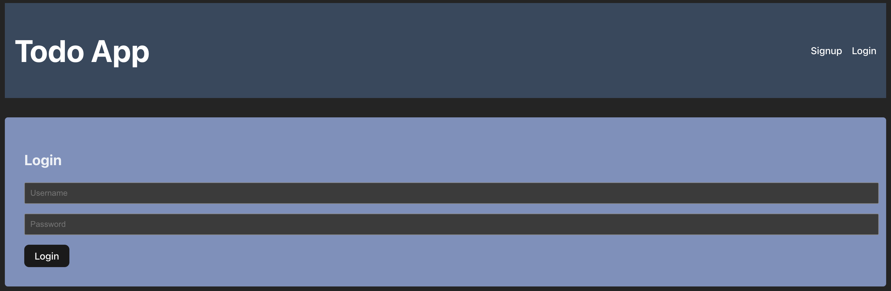

# Todo Application

This is a full-stack Todo application that allows users to sign up, log in, and manage a list of todos. The backend is built with Node.js and Express, using MongoDB as the database. The frontend is built with React and Axios for handling HTTP requests, and uses **Vite** as the bundler.

## Features

- **User Authentication**: Users can sign up and log in to the application. Authentication is handled using JWT tokens.
- **Todo Management**: Logged-in users can:
  - Create new todos.
  - View their list of todos.
  - Edit the title and description of a todo.
  - Mark todos as completed.
  - Delete todos.
- **RESTful API**: A structured API for both public (non-authenticated) and private (authenticated) routes.

## Tech Stack

### Backend:
- **Node.js** with **Express.js**
- **MongoDB** with **Mongoose** for database management
- **JWT** for authentication
- **dotenv** for environment variables
- **cors** for handling cross-origin requests

### Frontend:
- **React** with React Router for frontend routing
- **Vite** as the bundler
- **Axios** for making HTTP requests
- **Local Storage** for storing JWT tokens

## Installation

1. Clone the repository:

   ```bash
   git clone https://github.com/srinjoydutta03/todo-application.git
   cd todo-application
   ```

2. Install dependencies 

   ```bash
   npm install
   ```

3. Install dependencies for the frontend:

   ```bash
   cd frontend
   npm install
   ```

## Setup

1. Create a `.env` file in the `backend` directory with the following environment variables:

   ```
   MONGODB_CONNECTION_URL=your_mongo_db_connection_url
   JWT_SECRET=your_jwt_secret_key
   ```

2. In the `frontend/src/App.jsx`, update the `axios.defaults.baseURL` if your backend is running on a different URL or port.

## Running the Application

1. Start the backend server:

   ```bash
   cd backend
   node server.js
   ```

2. Start the frontend development server (using Vite):

   ```bash
   cd frontend
   npm run dev
   ```

3. Open the application in your browser at the URL provided by Vite, typically `http://localhost:5173`.

## API Endpoints

### Public Routes
- `POST /api/public/signup`: Register a new user.
- `POST /api/public/login`: Login and receive a JWT token.

### Private Routes (Require Authentication)
- `GET /api/private/todos`: Get all todos for the logged-in user.
- `POST /api/private/todos`: Create a new todo.
- `PUT /api/private/todos/:id`: Update an existing todo.
- `PATCH /api/private/todos/:id`: Mark a todo as completed.
- `DELETE /api/private/todos/:id`: Delete a todo.

## Authentication

The app uses **JWT (JSON Web Token)** for authentication. After a user logs in, a token is stored in the browser's `localStorage` and is sent with every request to protected routes via the `Authorization` header.

Example:

```
Authorization: Bearer <your_jwt_token>
```

## Screenshots

### Todo List Page


### Login Page


## License

This project is licensed under the MIT License.
```

